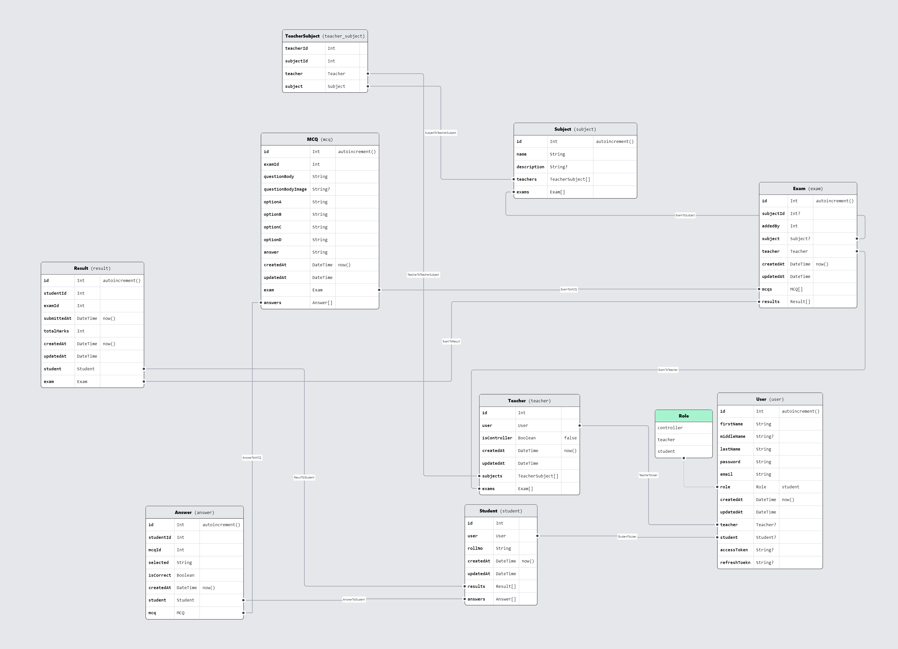

# Evolver

A robust online examination platform built with Node.js and PostgreSQL, featuring user roles (Controller, Teacher, Student) and Admin Panel, secure role-based access control, subject and exam management, and result generation. Designed for efficient and scalable academic assessments.

### Database Model:



### Student

Available Exams

Exam Portal (`DONE`)

Scores

Edit Profile

### Teachers

All Exams

Exam Results

Add Exam

Edit Profile

### Controller

Add Teacher

All Teacher

Add Student

All Student

Add Subject

Exam -> Result

Add Exam

Edit Profile

```
TODO:

- Rectify Login Signup
- Student add
```

frontend - vercel/netlify  
backend - render  
database - neon DB

{
"rewrites": [
{
"source": "/(.*)",
"destination": "/index.html"
}
]
}

NAVBAR
